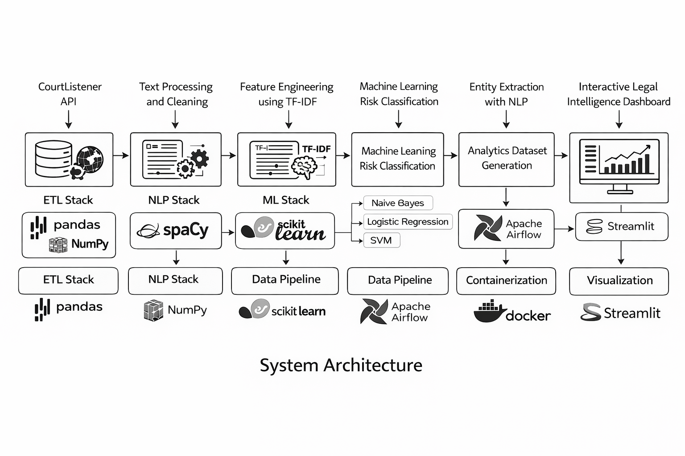
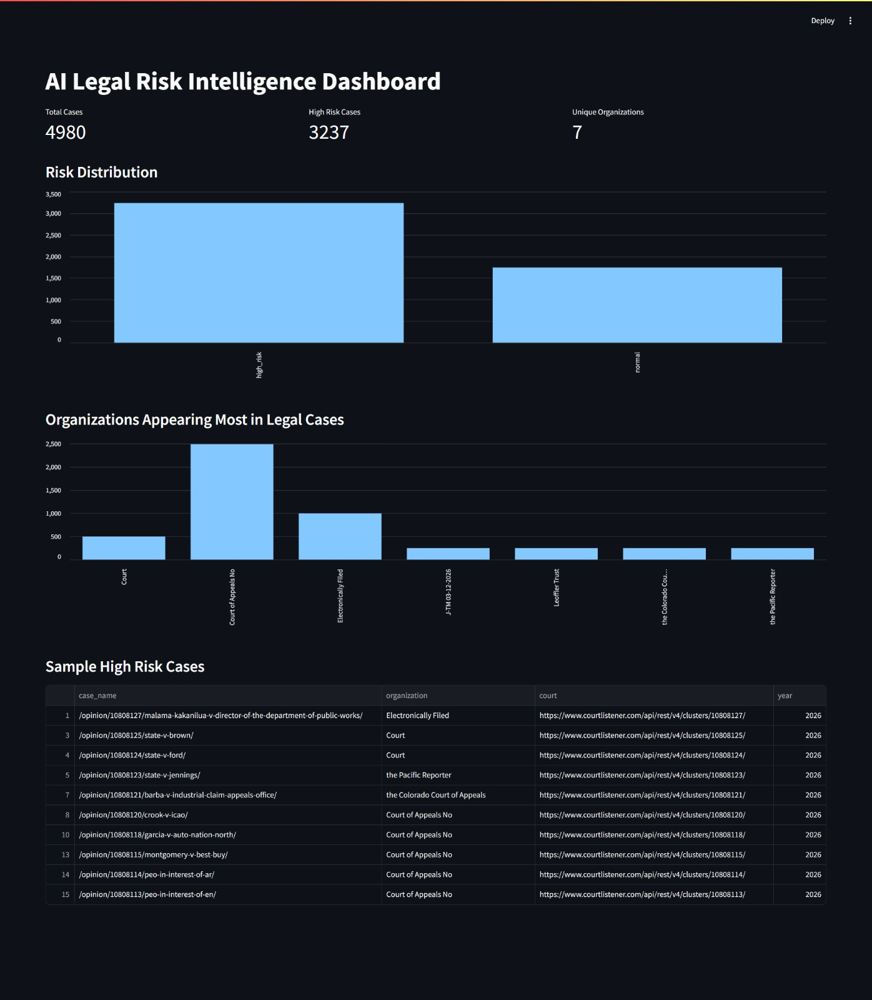

# AI Driven Legal and Risk Intelligence Platform

An end to end AI powered legal analytics platform that ingests thousands of court case documents, applies Natural Language Processing and Machine Learning to detect legal risk patterns, and visualizes insights through an interactive analytics dashboard.

The platform automates the entire pipeline from legal data ingestion to risk analysis and intelligence visualization using modern data engineering and machine learning tools.

# Project Overview

Legal organizations and compliance teams must analyze large volumes of court documents to detect regulatory risks, litigation trends, and high risk legal activity.

This platform builds an automated pipeline that:

- Collects legal case data from public legal databases
- Processes unstructured legal text using NLP
- Applies machine learning models to classify legal risk
- Extracts entities such as organizations involved in litigation
- Generates analytics datasets for legal intelligence
- Visualizes insights through an interactive dashboard

# System Architecture

Below is the high level architecture of the platform.

# Streamlit Dashboard

The platform provides an interactive legal intelligence dashboard built using Streamlit.

The dashboard visualizes:

- Legal risk distribution
- Top organizations appearing in lawsuits
- High risk legal case samples

# Key Features

- **Automated Legal Data Ingestion**  
  Collects legal case records from the CourtListener API and stores them as structured datasets.

- **NLP Based Text Processing**  
  Cleans and processes unstructured legal documents for analysis.

- **Risk Classification**  
  Converts legal text into numerical features and classifies cases into risk categories.

- **Model Benchmarking**  
  Evaluates multiple models including Naive Bayes, Logistic Regression, and Support Vector Machine.

- **Entity Extraction**  
  Identifies organizations mentioned in legal case documents.

- **Legal Intelligence Analytics**  
  Generates insights such as legal risk distribution, frequent organizations in lawsuits, and court activity trends.

- **Workflow Automation**  
  Automates the data pipeline from ingestion to model analysis.

- **Containerized Deployment**  
  Ensures consistent environments and simplified deployment.

  
# Technology Stack

| Category | Tools / Technologies |
|--------|----------------------|
| Programming Language | Python |
| Data Processing | Pandas, NumPy |
| Natural Language Processing | spaCy |
| Machine Learning | scikit-learn |
| Feature Engineering | TF-IDF Vectorization |
| Visualization | Streamlit |
| Workflow Orchestration | Apache Airflow |
| Containerization | Docker |
| Data Source | CourtListener Legal Case Database |

# Data Pipeline Workflow

1. **Data Ingestion:** Legal cases are collected from the CourtListener API using a Python scraper.
2. **Data Storage:** Raw legal documents are stored as structured datasets.
3. **Text Processing:** Legal text is cleaned and prepared for NLP analysis.
4. **Feature Engineering:** TF-IDF vectorization converts legal text into numerical features.
5. **Machine Learning Classification:** ML models classify legal cases into risk categories.
6. **Entity Extraction:** Organizations mentioned in legal documents are extracted using spaCy.
7. **Analytics Generation:** Processed datasets are enriched with risk labels and entity information.
8. **Workflow Orchestration:** Apache Airflow schedules and executes the pipeline.
9. **Visualization:** Streamlit dashboard presents legal intelligence insights.

# Example Insights Generated

The system produces analytics such as:

- Distribution of high risk legal cases
- Litigation trends across time
- Organizations frequently involved in lawsuits
- Courts handling the largest number of cases
- Machine learning based identification of risky litigation

# Build and Run

'''
git clone <repo>
cd AI-Driven-Legal-and-Risk-Intelligence-Platform

pip install -r requirements.txt

python -m spacy download en_core_web_sm

streamlit run dashboard/app.py
'''

# Future Improvements

Potential enhancements include:

- Legal topic modeling
- Knowledge graph of legal entities
- Real time data pipeline
- Deep learning based legal document classification
- Semantic search for legal documents

# Acknowledgements
Thanks to the open-source machine learning and data science community, as well as the legal data initiatives that made this project possible. Special appreciation to the CourtListener platform for providing access to legal case data and to the developers of the open-source libraries that enabled efficient data processing, natural language analysis, and model development ❤️